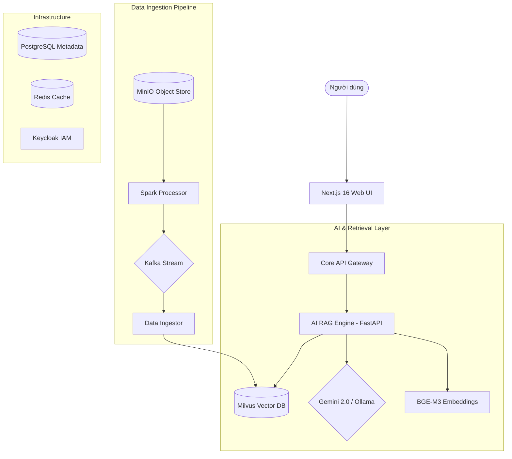

# 🚀 Hệ thống Xử lý Tài liệu Thông minh (Bigdata AI RAG System)

Chào mừng bạn đến với hệ thống RAG (Retrieval-Augmented Generation) tiên tiến, được thiết kế để xử lý và truy vấn bộ dữ liệu văn bản khổng lồ. Hệ thống này kết hợp sức mạnh của công nghệ Vector Search hiệu năng cao và các mô hình ngôn ngữ lớn (LLM) hiện đại nhất.

---

## 🏛️ Kiến trúc Hệ thống

Hệ thống được xây dựng trên kiến trúc microservices hướng sự kiện, đảm bảo khả năng mở rộng cao (Scalability) và tính sẵn sàng cao (High Availability).



---

## 🛠️ Công nghệ cốt lõi

| Thành phần | Công nghệ sử dụng |
| :--- | :--- |
| **Frontend** | Next.js 16 (React 19), Tailwind CSS 4, Framer Motion, Shadcn UI |
| **Backend API** | FastAPI, Python 3.12 |
| **LLM Provider** | Google Gemini 2.0 Flash, Ollama (Llama 3.2:1b) |
| **Embedding** | BAAI/BGE-M3 (Multi-lingual) |
| **Vector DB** | Milvus Standalone (v2.3+) |
| **Message Broker** | Apache Kafka |
| **Lưu trữ** | MinIO (S3 compatible), PostgreSQL 15, Redis 7 |
| **Giám sát** | Prometheus, Grafana, ELK Stack (Elasticsearch, Logstash, Kibana) |

---

## 🌍 Hướng dẫn Triển khai & Di động (Portability)

Dự án hỗ trợ chuyển đổi máy chủ (migration) cực kỳ nhanh chóng thông qua việc tách biệt **Dữ liệu cấu trúc (Brain)** và **Dữ liệu thô (Raw Data)**.

### 1. Đồng bộ lên Hugging Face (Từ máy gốc)
Nếu bạn có thay đổi về index hoặc database, hãy chạy:
```bash
export HF_TOKEN="your_token_here"
python3 sync_to_hf.py
```
Dữ liệu sẽ được bảo mật dưới dạng snapshot và đẩy lên [Hugging Face Assets](https://huggingface.co/datasets/Cong123779/bigdata-assets).

### 2. Thiết lập trên máy mới (One-Touch Setup)

Quy trình thiết lập tiêu chuẩn trên một thiết bị mới:

**Bước A: Tải mã nguồn**
```bash
git clone https://github.com/congkx123789/bigdata_project.git
cd bigdata_project
```

**Bước B: Chạy Setup thông minh**
Thay vì cấu hình thủ công, hãy chạy script duy nhất:
```bash
export HF_TOKEN="your_token_here"
chmod +x setup.sh
./setup.sh
```

**Bước C: Lựa chọn khôi phục (Interactive)**
Trong quá trình chạy `./setup.sh`, hệ thống sẽ đưa ra 2 lựa chọn quan trọng:
1.  **Restore Data from HF? (y/n)**: Chọn `y` để tải toàn bộ "bộ não" (Milvus, Postgres) từ Hugging Face. Điều này giúp bạn có thể Chat ngay lập tức mà không cần xử lý lại dữ liệu.
2.  **Download Raw Datasets? (y/n)**: Chọn `y` nếu bạn muốn tải 48GB dữ liệu thô (RVL-CDIP) về máy để tiếp tục nghiên cứu hoặc huấn luyện.

---

## 📂 Cấu trúc thư mục chính

- `frontend/`: Giao diện người dùng Next.js hiện đại.
- `infra/`: Cấu hình Docker Compose cho toàn bộ hạ tầng lõi.
- `services/`: Các microservices (ai-rag-engine, core-api, ingestion).
- `datasets/`: Thư mục chứa dữ liệu thô (Git-ignored).
- `monitoring/`: Cấu hình Dashboard Grafana và Prometheus.
- `sync_to_hf.py` / `restore_from_hf.py`: Bộ công cụ đồng bộ hóa đám mây.
- `download_datasets.sh`: Công cụ tải dữ liệu thô tự động.

---

## 👨‍💻 Tác giả
Phát triển và bảo trì bởi **congkx123789**. 🇻🇳
