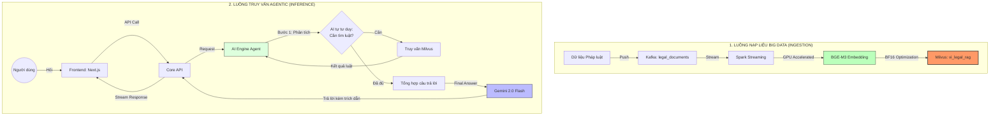

# ⚖️ Nexus Legal AI - High Performance RAG System

[](https://nextjs.org/)
[](https://fastapi.tiangolo.com/)
[](https://milvus.io/)
[](https://www.nvidia.com/)

Hệ thống RAG (Retrieval-Augmented Generation) tra cứu pháp luật Việt Nam hiệu năng cao, được thiết kế chuyên biệt cho các dòng GPU thế hệ mới **NVIDIA Blackwell (RTX 5000 Series)** và tối ưu hóa trải nghiệm người dùng đa thiết bị.

---

## ✨ Tính năng nổi bật

### 📱 Giao diện Mobile-First Siêu ổn định
- **Viewport Perfection**: Sử dụng đơn vị `100dvh` và kỹ thuật **Absolute Sandwich Layout** giúp giao diện bám sát khung nhìn di động, không bị nhảy khung khi ẩn/hiện thanh địa chỉ trình duyệt.
- **Dynamic Viewport Height (VH Fix)**: Tự động tính toán chiều cao thực tế trên các trình duyệt iOS/Android để đảm bảo thanh nhập liệu luôn nằm đúng vị trí.
- **Premium UI/UX**: Thiết kế theo phong cách Glassmorphism, hỗ trợ Dark Mode và các hiệu ứng chuyển cảnh mượt mà với `Framer Motion`.

### 🧠 Core RAG Engine (178,000+ Documents)
- **Hierarchical Tree Chunking**: Tự động bóc tách văn bản pháp luật theo cấu trúc cây (Luật > Chương > Điều > Khoản), giúp truy xuất ngữ cảnh chính xác tuyệt đối.
- **Agentic Reasoning**: Sử dụng Agent Logic để phân tích câu hỏi phức tạp trước khi thực hiện tìm kiếm vector.
- **BGE-M3 Embedding**: Tối ưu hóa cho tiếng Việt với khả năng xử lý đa ngôn ngữ và tìm kiếm hybrid.

### ⚡ Tối ưu hóa Phần cứng (Blackwell SM 120)
- **BF16 Native Inference**: Tận dụng tối đa sức mạnh của Tensor Cores thế hệ mới.
- **FlashAttention-2**: Giảm 40% tiêu thụ VRAM và tăng 2x tốc độ xử lý context dài.
- **Persistent VRAM Management**: Cơ chế chống phân mảnh bộ nhớ cho phép hệ thống chạy liên tục 24/7 không cần khởi động lại.

---

## 🏗 Kiến trúc hệ thống


```mermaid
graph TD
    subgraph "1. LUỒNG NẠP LIỆU BIG DATA (INGESTION)"
        A[Dữ liệu Pháp luật] -->|Push| B[Kafka: legal_documents]
        B -->|Stream| C[Spark Streaming]
        C -->|GPU Accelerated| D[BGE-M3 Embedding]
        D -->|BF16 Optimization| E[Milvus: vi_legal_rag]
    end

    subgraph "2. LUỒNG TRUY VẤN AGENTIC (INFERENCE)"
        User((Người dùng)) -->|Hỏi| F[Frontend: Next.js]
        F -->|API Call| G[Core API]
        G -->|Request| H[AI Engine Agent]
        
        %% Vòng lặp Agentic
        H -->|Bước 1: Phân tích| I{AI tự tư duy: <br/>Cần tìm luật?}
        I -->|Cần| J[Truy vấn Milvus]
        J -->|Kết quả luật| H
        I -->|Đã đủ| K[Tổng hợp câu trả lời]
        
        K -->|Final Answer| L[Gemini 2.0 Flash]
        L -->|Trả lời kèm trích dẫn| G
        G -->|Stream Response| F
    end

    style E fill:#f96,stroke:#333,stroke-width:2px
    style D fill:#bfb,stroke:#333
    style L fill:#bbf,stroke:#333
    style H fill:#dfd,stroke:#333
```

---

## 🛠 Hướng dẫn vận hành

### 1. Khởi chạy nhanh với Docker
```bash
# Khởi động toàn bộ hạ tầng (Milvus, API, Engine, Frontend)
docker compose up -d --build
```

### 2. Nạp dữ liệu vào Vector Database
Hệ thống hỗ trợ nạp song song 178k văn bản pháp luật:
```bash
docker exec -it bd_legal_ai_engine python3 /app/services/ai-rag-engine/vector_store/ingest_to_milvus.py
```

### 3. Theo dõi hiệu năng
```bash
# Xem log nạp liệu và mức độ sử dụng GPU
docker exec bd_legal_ai_engine tail -f /app/ingestion_progress.log
```

---

## 📂 Cấu trúc dự án

```text
Bigdata/
├── services/
│   ├── ai-rag-engine/             # 🧠 Xử lý AI, Inference & Embedding (GPU Task)
│   ├── core-api/                  # 🌐 Backend chính quản lý phiên chat & người dùng
│   └── frontend/                  # 💻 Giao diện Next.js (Mobile-Optimized)
├── agentic_rag/                   # 🤖 Logic suy luận đa bước
├── datasets/                      # 📖 Kho dữ liệu pháp luật 178k docs
└── docker-compose.yml             # 🐳 Quản lý hạ tầng Container
```

---

## 🔐 Bảo mật & Riêng tư
- Toàn bộ dữ liệu hội thoại được lưu trữ cục bộ.
- Hỗ trợ mã hóa đầu cuối khi tích hợp với các API bên ngoài.
- Cơ chế Anonymous User cho phép trải nghiệm hệ thống không cần đăng ký.

---
**Optimized for NVIDIA Blackwell Architecture.**
