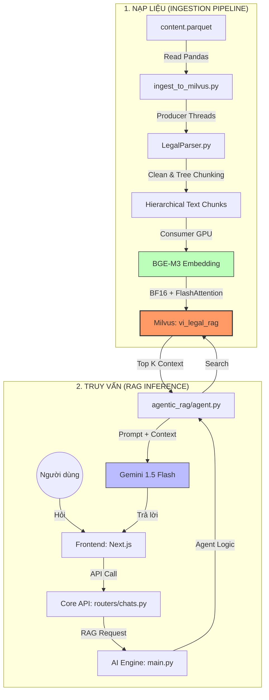

# ⚖️ Nexus Legal AI - High Performance RAG System

Hệ thống RAG (Retrieval-Augmented Generation) tra cứu pháp luật Việt Nam hiệu năng cao, được tối ưu hóa đặc biệt cho kiến trúc **NVIDIA Blackwell (RTX 5000 Series)**.

## 🏗 Kiến trúc hệ thống


```mermaid
graph TD
    subgraph "1. NẠP LIỆU (INGESTION PIPELINE)"
        A[content.parquet] -->|Read Pandas| B[ingest_to_milvus.py]
        B -->|Producer Threads| C[LegalParser.py]
        C -->|Clean & Tree Chunking| D[Hierarchical Text Chunks]
        D -->|Consumer GPU| E[BGE-M3 Embedding]
        E -->|BF16 + FlashAttention| F[Milvus: vi_legal_rag]
    end

    subgraph "2. TRUY VẤN (RAG INFERENCE)"
        User((Người dùng)) -->|Hỏi| G[Frontend: Next.js]
        G -->|API Call| H[Core API: routers/chats.py]
        H -->|RAG Request| I[AI Engine: main.py]
        I -->|Agent Logic| J[agentic_rag/agent.py]
        J -->|Search| F
        F -->|Top K Context| J
        J -->|Prompt + Context| K[Gemini 1.5 Flash]
        K -->|Trả lời| G
    end

    style F fill:#f96,stroke:#333,stroke-width:2px
    style E fill:#bfb,stroke:#333
    style K fill:#bbf,stroke:#333
```

## 🚀 Công nghệ & Tối ưu hóa

### 💎 GPU Optimizations (Blackwell SM 120)
- **Native BF16**: Tối ưu hóa độ chính xác Brain Float 16, nhanh hơn FP16 trên dòng RTX 5000.
- **PyTorch SDPA (FlashAttention)**: Kernel tăng tốc tính toán Attention, giảm tiêu thụ VRAM.
- **torch.compile**: Ahead-of-time (AOT) graph optimization giúp giảm độ trễ thực thi.
- **expandable_segments**: Quản lý VRAM thông minh, chống phân mảnh bộ nhớ khi chạy lâu dài.

### 📊 Data Pipeline (178k Docs)
- **Hierarchical RAG**: Tự động cấu trúc lại văn bản theo dạng `Luật > Chương > Điều > Khoản`.
- **Producer-Consumer Threading**: Song song hóa việc đọc CPU và tính toán GPU.
- **OOM Auto-Recovery**: Cơ chế tự động chia nhỏ batch khi gặp văn bản cực dài để tránh sập GPU.
- **Resume-from-checkpoint**: Khả năng tiếp tục nạp liệu từ vị trí dừng cuối cùng.

## 🛠 Cài đặt & Vận hành

### Yêu cầu
- Docker & NVIDIA Container Toolkit.
- NVIDIA GPU Blackwell (RTX 5060 Ti / 5070 / 5080 / 5090).

### Khởi chạy hệ thống
```bash
docker compose up -d
```

### Chạy nạp liệu (Ingestion)
```bash
# Chạy trong container
docker exec -d bd_legal_ai_engine python3 /app/services/ai-rag-engine/vector_store/ingest_to_milvus.py
```

### Theo dõi tiến độ live
```bash
docker exec bd_legal_ai_engine tail -f /app/ingestion_progress.log
```

## 📂 Cấu trúc thư mục chi tiết

```text
Bigdata/
├── services/
│   ├── ai-rag-engine/             # 🧠 Trái tim AI: Xử lý Inference & Embedding
│   │   ├── main.py                # FastAPI Server chính
│   │   └── vector_store/          # Quản lý nạp & truy vấn Milvus
│   │       ├── ingest_to_milvus.py # Script nạp 178k docs (Tối ưu Blackwell)
│   │       ├── legal_parser.py    # Logic dọn dẹp HTML & Phân cấp Tiêu đề
│   │       └── test_search.py     # Script kiểm tra chất lượng RAG
│   │
│   ├── core-api/                  # 🌐 Backend: Quản lý người dùng & Hội thoại
│   │   ├── routers/               # API Endpoints (chats, history)
│   │   └── database.py            # SQLite/PostgreSQL quản lý phiên chat
│   │
│   └── frontend/                  # 💻 Giao diện Web: Next.js + TailwindCSS
│
├── agentic_rag/                   # 🤖 Logic Agent: Phân tích & Suy luận đa bước
├── datasets/                      # 📖 Kho dữ liệu pháp luật (Parquet format)
├── docker-compose.yml             # 🐳 Hạ tầng (Milvus, MinIO, API, Engine)
└── .gitignore                     # Cấu hình loại bỏ dữ liệu nặng
```

## 📂 Cấu trúc dự án
- `services/ai-rag-engine`: Dịch vụ xử lý AI, nạp vector và trích xuất thông tin.
- `services/core-api`: Backend xử lý logic nghiệp vụ và quản lý hội thoại.
- `services/frontend`: Giao diện người dùng Next.js hiện đại.
- `datasets/vi-legal`: Tập dữ liệu 178k văn bản pháp luật Việt Nam.

---
*Developed & Optimized by Antigravity AI.*
