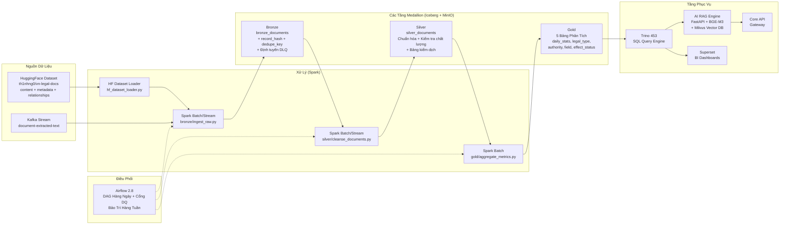

# Kiến Trúc Hệ Thống — Pipeline Xử Lý Văn Bản Pháp Luật Việt Nam

## Tổng Quan Hệ Thống

Pipeline này thu thập, xử lý và phục vụ bộ dữ liệu **Văn bản pháp luật Việt Nam**
(`th1nhng0/vietnamese-legal-documents`) thông qua kiến trúc **Medallion Lakehouse** chuyên nghiệp.
Bộ dữ liệu bao gồm luật, nghị định, thông tư, quyết định và các văn bản quy phạm pháp luật khác
được thu thập từ `vbpl.vn` — Cổng thông tin pháp luật chính thức của Chính phủ Việt Nam.

## Sơ Đồ Pipeline Dữ Liệu

## Các Tầng Medallion

### Bronze — Thu Thập Dữ Liệu Thô (Chỉ Thêm Mới)

**Bảng**: `lakehouse.public.bronze_documents`
**Phân vùng**: `ingest_date`

Các trường bổ sung so với dữ liệu gốc:
- `record_hash` — SHA256(doc_id + raw_text[:200]) để xác định trùng lặp một cách tất định
- `dedupe_key` — Khóa tổng hợp (doc_id + loai_van_ban) đảm bảo an toàn khi chạy lại
- `raw_text` — Văn bản thuần từ `content_html` sau khi loại bỏ thẻ HTML

**Bảng DLQ**: `lakehouse.public.bronze_dlq` — Lưu các tin nhắn Kafka không thể phân tích được

### Silver — Chuẩn Hóa & Kiểm Tra Chất Lượng

**Bảng**: `lakehouse.public.silver_documents`
**Kiểm dịch**: `lakehouse.public.silver_quarantine`
**Phân vùng**: `ingest_date`

Các phép biến đổi:
- `char_count` — Đếm ký tự chính xác (sửa lỗi dùng `length()` trước đây)
- `word_count` — Đếm từ phù hợp với tiếng Việt (tách theo khoảng trắng)
- `quality_score` — Chỉ số chất lượng `min(1.0, char_count / 2000)` từ 0.0 đến 1.0
- `issuance_date` — Phân tích từ định dạng DD/MM/YYYY sang ISO DATE
- `effective_date`, `expiry_date` — Chuẩn hóa ngày tương tự
- `effect_status` — Chuẩn hóa: còn hiệu lực / hết hiệu lực / chưa có hiệu lực

Cổng DQ từ chối tài liệu có `char_count < 50` hoặc `word_count < 5` sang bảng kiểm dịch.

### Gold — Phân Tích Nghiệp Vụ (5 Bảng)

| Bảng | Độ Granularity | Chỉ Số Chính |
|------|----------------|--------------|
| `gold_daily_stats` | Theo ngày | total_documents, avg_word_count, avg_quality_score |
| `gold_legal_type_breakdown` | Ngày × loai_van_ban | document_count, avg_word_count |
| `gold_issuing_authority` | Ngày × co_quan_ban_hanh | document_count |
| `gold_legal_field_stats` | Ngày × linh_vuc × nganh | document_count, avg_quality_score |
| `gold_effect_status` | Ngày × effect_status | document_count |

## Stack Công Nghệ

| Thành Phần | Công Nghệ | Phiên Bản |
|-----------|-----------|-----------|
| Xử lý dữ liệu | Apache Spark | 3.5 |
| Định dạng bảng | Apache Iceberg | 1.6.1 |
| Lưu trữ đối tượng | MinIO (tương thích S3) | Latest |
| Iceberg Catalog | PostgreSQL (JDBC) | 15 |
| Message Broker | Apache Kafka | 7.5.0 |
| Query Engine | Trino | 453 |
| BI Dashboard | Apache Superset | Latest |
| Vector DB | Milvus | 2.3.15 |
| Embedding | BAAI/BGE-M3 | Đa ngôn ngữ |
| Điều phối | Apache Airflow | 2.8.1 |
| Serving API | FastAPI + Python | 3.12 |
| Frontend | Next.js 16 | React 19 |
| Xác thực | Keycloak | 24.0 |
| Giám sát | Prometheus + Grafana + ELK | Latest |

## Luồng Dữ Liệu

1. **Hàng ngày**: Airflow DAG kích hoạt `hf_dataset_loader.py` — tải file Parquet từ HuggingFace
2. Spark đọc Parquet → loại bỏ HTML → thêm `record_hash`/`dedupe_key` → ghi vào Bronze
3. Spark đọc Bronze → chuẩn hóa ngày/văn bản → kiểm tra DQ → ghi Silver + Quarantine
4. Airflow kiểm tra manifest DQ — rẽ nhánh sang Gold hoặc gửi cảnh báo kiểm dịch
5. Spark tổng hợp Silver → vật chất hóa 5 bảng Gold
6. Trino truy vấn các bảng Iceberg vật lý cho dashboard Superset và chatbot AI
7. **Hàng tuần**: Bảo trì Iceberg (nén file, xóa snapshot, dọn file mồ côi)
