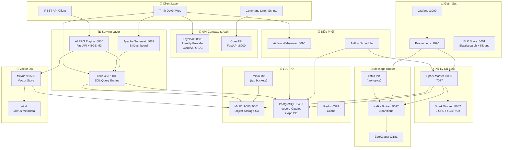
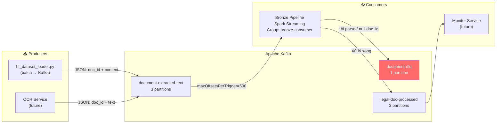
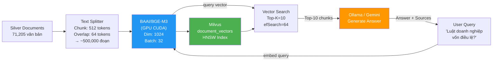
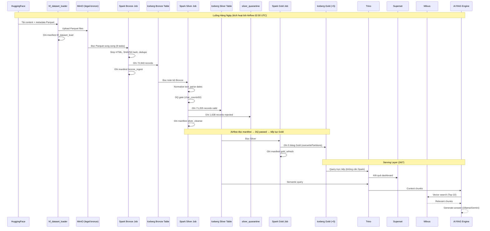

# 🏗️ Kiến Trúc Hạ Tầng Chi Tiết — Pipeline Văn Bản Pháp Luật Việt Nam

> Tài liệu này mô tả chi tiết topology hạ tầng, sơ đồ cluster từng thành phần, cấu hình node, cổng mạng và sự khác biệt giữa môi trường **Laptop (Dev)** và **Server (Production)**.

---

## 1. Sơ Đồ Tổng Thể Hạ Tầng (Docker Compose)

Toàn bộ hệ thống chạy trên **Docker Compose** gồm **18 container** giao tiếp qua mạng nội bộ `bigdata-network`.



---

## 2. Kafka Cluster — Cấu Hình Chi Tiết

### 2.1 Môi Trường Dev (Laptop) — 1 Broker

```
┌─────────────────────────────────────────────────────────────────┐
│                    KAFKA CLUSTER (Dev — 1 Node)                 │
│                                                                 │
│  ┌─────────────────────────────────────────────────────────┐   │
│  │  ZooKeeper (container: zookeeper)                       │   │
│  │  Port: 2181                                             │   │
│  │  Vai trò: Quản lý metadata cluster, leader election     │   │
│  └───────────────────────────┬─────────────────────────────┘   │
│                              │ ZooKeeper Connect               │
│  ┌───────────────────────────▼─────────────────────────────┐   │
│  │  Kafka Broker 1 (container: kafka)                       │   │
│  │  ┌─────────────────────────────────────────────────┐    │   │
│  │  │  BROKER_ID: 1                                   │    │   │
│  │  │  Port ngoài (host): 9092                        │    │   │
│  │  │  Port nội bộ (Docker): 29092                    │    │   │
│  │  │                                                 │    │   │
│  │  │  Topics:                                        │    │   │
│  │  │  ┌─────────────────────────────────────────┐   │    │   │
│  │  │  │ document-extracted-text                  │   │    │   │
│  │  │  │   Partitions: 3  │  Replication: 1      │   │    │   │
│  │  │  │   ┌──────────┬──────────┬──────────┐    │   │    │   │
│  │  │  │   │ Part. 0  │ Part. 1  │ Part. 2  │    │   │    │   │
│  │  │  │   │ Leader:1 │ Leader:1 │ Leader:1 │    │   │    │   │
│  │  │  │   └──────────┴──────────┴──────────┘    │   │    │   │
│  │  │  ├─────────────────────────────────────────┤   │    │   │
│  │  │  │ document-dlq                             │   │    │   │
│  │  │  │   Partitions: 1  │  Replication: 1      │   │    │   │
│  │  │  ├─────────────────────────────────────────┤   │    │   │
│  │  │  │ legal-doc-processed                      │   │    │   │
│  │  │  │   Partitions: 3  │  Replication: 1      │   │    │   │
│  │  │  └─────────────────────────────────────────┘   │    │   │
│  │  └─────────────────────────────────────────────────┘    │   │
│  └─────────────────────────────────────────────────────────┘   │
└─────────────────────────────────────────────────────────────────┘
```

### 2.2 Môi Trường Production — 3 Brokers

```
┌─────────────────────────────────────────────────────────────────────────┐
│                    KAFKA CLUSTER (Production — 3 Nodes)                  │
│                                                                          │
│  ┌─────────────────────────────────────────────────────────────────┐    │
│  │  ZooKeeper Ensemble (3 nodes — đảm bảo High Availability)       │    │
│  │  ┌────────────┐  ┌────────────┐  ┌────────────┐                │    │
│  │  │ ZK Node 1  │  │ ZK Node 2  │  │ ZK Node 3  │                │    │
│  │  │ :2181      │  │ :2182      │  │ :2183      │                │    │
│  │  │ (Leader)   │  │ (Follower) │  │ (Follower) │                │    │
│  │  └─────┬──────┘  └─────┬──────┘  └─────┬──────┘                │    │
│  └────────┼───────────────┼───────────────┼──────────────────────-┘    │
│           │               │               │                              │
│  ┌────────▼───────────────▼───────────────▼───────────────────────-┐   │
│  │  Kafka Brokers                                                    │   │
│  │                                                                   │   │
│  │  ┌─────────────────┐  ┌─────────────────┐  ┌─────────────────┐  │   │
│  │  │  Broker 1        │  │  Broker 2        │  │  Broker 3        │  │   │
│  │  │  :9092           │  │  :9093           │  │  :9094           │  │   │
│  │  │  RAM: 4 GB       │  │  RAM: 4 GB       │  │  RAM: 4 GB       │  │   │
│  │  └────────┬─────────┘  └────────┬─────────┘  └────────┬─────────┘  │   │
│  │           │                     │                     │              │   │
│  │  Topic: document-extracted-text (Partitions=3, Replication=3)       │   │
│  │  ┌──────────────────────────────────────────────────────────┐       │   │
│  │  │  Partition 0  │ Leader: Broker1 │ Replica: Broker2,3     │       │   │
│  │  │  Partition 1  │ Leader: Broker2 │ Replica: Broker1,3     │       │   │
│  │  │  Partition 2  │ Leader: Broker3 │ Replica: Broker1,2     │       │   │
│  │  └──────────────────────────────────────────────────────────┘       │   │
│  │                                                                      │   │
│  │  Topic: document-dlq (Partitions=1, Replication=3)                  │   │
│  │  ┌──────────────────────────────────────────────────────────┐       │   │
│  │  │  Partition 0  │ Leader: Broker1 │ Replica: Broker2,3     │       │   │
│  │  └──────────────────────────────────────────────────────────┘       │   │
│  └────────────────────────────────────────────────────────────────────-┘   │
└─────────────────────────────────────────────────────────────────────────────┘
```

### 2.3 Producers và Consumers



**Kiểm tra Kafka hoạt động:**
```bash
# Xem danh sách topics
docker exec kafka kafka-topics --bootstrap-server kafka:29092 --list

# Xem chi tiết partition của 1 topic
docker exec kafka kafka-topics \
  --bootstrap-server kafka:29092 \
  --describe --topic document-extracted-text
# Output:
# Topic: document-extracted-text  PartitionCount: 3  ReplicationFactor: 1
# Topic: document-extracted-text  Partition: 0  Leader: 1  Replicas: 1  Isr: 1
# Topic: document-extracted-text  Partition: 1  Leader: 1  Replicas: 1  Isr: 1
# Topic: document-extracted-text  Partition: 2  Leader: 1  Replicas: 1  Isr: 1

# Xem số lượng message trong DLQ
docker exec kafka kafka-run-class kafka.tools.GetOffsetShell \
  --broker-list kafka:29092 --topic document-dlq --time -1
# Output: document-dlq:0:0   ← 0 message trong DLQ = không có lỗi
```

---

## 3. MinIO Cluster — Object Storage

### 3.1 Môi Trường Dev — 1 Node (Standalone)

```
┌─────────────────────────────────────────────────────────────────┐
│              MinIO Standalone (container: minio)                │
│                                                                 │
│  Port API:     9000  (S3-compatible)                           │
│  Port Console: 9001  (Web UI)                                  │
│  RAM:          512 MB min                                       │
│  Storage:      Docker volume: minio_data                        │
│                                                                 │
│  Bucket Layout:                                                 │
│  ┌─────────────────────────────────────────────────────────┐   │
│  │  legal-bronze/                                           │   │
│  │  ├── hf/th1nhng0/vietnamese-legal-documents/            │   │
│  │  │   ├── content/content_data.parquet      (~500 MB)    │   │
│  │  │   └── metadata/metadata_data.parquet    (~50 MB)     │   │
│  │                                                          │   │
│  │  documents/  (Iceberg Warehouse)                         │   │
│  │  └── warehouse/                                          │   │
│  │      └── public/                                         │   │
│  │          ├── bronze_documents/                           │   │
│  │          │   ├── metadata/         (Iceberg manifests)   │   │
│  │          │   └── data/             (Parquet data files)  │   │
│  │          │       ├── ingest_date=2024-06-01/             │   │
│  │          │       │   └── 00000-0-*.parquet               │   │
│  │          ├── silver_documents/    (tương tự)             │   │
│  │          ├── gold_daily_stats/    (tương tự)             │   │
│  │          └── ...                                         │   │
│  │                                                          │   │
│  │  legal-checkpoints/                                      │   │
│  │  ├── bronze/                      (Spark checkpoints)    │   │
│  │  └── silver/                                             │   │
│  └─────────────────────────────────────────────────────────┘   │
└─────────────────────────────────────────────────────────────────┘
```

### 3.2 Môi Trường Production — Distributed Mode (4 Nodes)

```
┌─────────────────────────────────────────────────────────────────────────┐
│              MinIO Distributed (Production — 4 Nodes × 4 Drives)        │
│                                Erasure Code: EC:4+2                     │
│                                                                          │
│  ┌──────────────────────┐  ┌──────────────────────┐                     │
│  │  MinIO Node 1         │  │  MinIO Node 2         │                     │
│  │  192.168.1.10:9000   │  │  192.168.1.11:9000   │                     │
│  │  ┌──┬──┬──┬──┐       │  │  ┌──┬──┬──┬──┐       │                     │
│  │  │D1│D2│D3│D4│       │  │  │D5│D6│D7│D8│       │                     │
│  │  └──┴──┴──┴──┘       │  │  └──┴──┴──┴──┘       │                     │
│  │  4 × 2 TB SSD         │  │  4 × 2 TB SSD         │                     │
│  └──────────────────────┘  └──────────────────────┘                     │
│                                                                          │
│  ┌──────────────────────┐  ┌──────────────────────┐                     │
│  │  MinIO Node 3         │  │  MinIO Node 4         │                     │
│  │  192.168.1.12:9000   │  │  192.168.1.13:9000   │                     │
│  │  ┌──┬──┬──┬──┐       │  │  ┌──┬──┬──┬──┐       │                     │
│  │  │D9│D10│D11│D12│    │  │  │D13│D14│D15│D16│   │                     │
│  │  └──┴──┴──┴──┘       │  │  └──┴──┴──┴──┘       │                     │
│  │  4 × 2 TB SSD         │  │  4 × 2 TB SSD         │                     │
│  └──────────────────────┘  └──────────────────────┘                     │
│                                                                          │
│  Tổng dung lượng: 16 × 2 TB = 32 TB raw                                │
│  Dung lượng hiệu dụng: ~21 TB (sau EC 4+2)                             │
│  Chịu lỗi: Mất 2 node hoặc 2 drive bất kỳ vẫn hoạt động               │
│                                                                          │
│  Load Balancer (nginx / HAProxy) :9000                                  │
│  → Round-robin đến 4 nodes                                               │
└─────────────────────────────────────────────────────────────────────────┘
```

### 3.3 Kiến Trúc Lưu Trữ Iceberg Trên MinIO

```
MinIO (S3-compatible)
└── documents/ (bucket = Iceberg Warehouse)
    └── warehouse/
        └── public/
            └── bronze_documents/          ← Iceberg table directory
                ├── metadata/
                │   ├── 00000-*.metadata.json   ← Snapshot 1 (ingestion ban đầu)
                │   ├── 00001-*.metadata.json   ← Snapshot 2 (ingestion ngày 2)
                │   ├── snap-*.avro              ← Snapshot manifest list
                │   └── *.avro                   ← Manifest files
                └── data/
                    ├── ingest_date=2024-06-01/  ← Partition 1
                    │   ├── 00000-0-*.parquet    ← File gốc (100 MB)
                    │   └── 00001-0-*.parquet    ← Sau compaction (500 MB)
                    └── ingest_date=2024-06-02/  ← Partition 2
                        └── 00000-0-*.parquet

Catalog (PostgreSQL):
  Table: iceberg_tables
  ┌─────────────────────────────────────────────────────┐
  │ catalog_name │ table_namespace │ table_name         │
  │ lakehouse    │ public          │ bronze_documents    │
  │ lakehouse    │ public          │ silver_documents    │
  │ lakehouse    │ public          │ gold_daily_stats    │
  │ ...          │ ...             │ ...                 │
  └─────────────────────────────────────────────────────┘
```

**Kiểm tra MinIO qua CLI:**
```bash
# Xem cấu trúc bucket
docker exec minio mc ls --recursive local/documents/warehouse/public/ --summarize
# Output:
# [2024-06-01] 105 MiB  warehouse/public/bronze_documents/data/ingest_date=2024-06-01/00000-0-abc.parquet
# [2024-06-01]  12 KiB  warehouse/public/bronze_documents/metadata/00000-abc.metadata.json
# ...
# Total: 287 objects, 2.3 GiB

# Xem disk usage theo bucket
docker exec minio mc du local/
# legal-bronze:      568 MiB
# legal-silver:       89 MiB
# documents:        2.3 GiB
# legal-checkpoints:  45 MiB
```

---

## 4. Apache Spark Cluster

### 4.1 Môi Trường Dev — 1 Master + 1 Worker

```
┌─────────────────────────────────────────────────────────────────┐
│                SPARK CLUSTER (Dev — 2 Containers)               │
│                                                                 │
│  ┌─────────────────────────────────────────────────────────┐   │
│  │  Spark Master (container: spark-master)                  │   │
│  │  URL:  spark://spark-master:7077                         │   │
│  │  UI:   http://localhost:8080                             │   │
│  │  RAM:  512 MB (master chỉ điều phối, không tính toán)   │   │
│  └───────────────────────────┬─────────────────────────────┘   │
│                              │                                  │
│                      Register Worker                            │
│                              │                                  │
│  ┌───────────────────────────▼─────────────────────────────┐   │
│  │  Spark Worker 1 (container: spark-worker)                │   │
│  │  UI:   http://localhost:8082                             │   │
│  │  Cores: 2                                                │   │
│  │  Memory: 4 GB                                            │   │
│  │                                                          │   │
│  │  Executor slots: 2 (1 executor × 2 cores)               │   │
│  │  ┌────────────────────────────────────────────────────┐ │   │
│  │  │  Executor 1                                        │ │   │
│  │  │  Cores: 2  │  Memory: 3 GB (1 GB reserved)         │ │   │
│  │  │  Tasks:                                            │ │   │
│  │  │    Task 1: Đọc Parquet partition 0                 │ │   │
│  │  │    Task 2: Đọc Parquet partition 1                 │ │   │
│  │  └────────────────────────────────────────────────────┘ │   │
│  └─────────────────────────────────────────────────────────┘   │
└─────────────────────────────────────────────────────────────────┘
```

### 4.2 Môi Trường Production — 1 Master + 3 Workers

```
┌─────────────────────────────────────────────────────────────────────────┐
│              SPARK CLUSTER (Production — 1 Master + 3 Workers)          │
│                                                                          │
│  ┌───────────────────────────────────────────────────────────────────┐  │
│  │  Spark Master                                                      │  │
│  │  spark://spark-master:7077                                         │  │
│  │  RAM: 2 GB  │  Cores: 2 (chỉ scheduling)                          │  │
│  └──────┬────────────────┬────────────────┬──────────────────────────┘  │
│         │                │                │                               │
│  ┌──────▼──────┐  ┌──────▼──────┐  ┌──────▼──────┐                      │
│  │  Worker 1   │  │  Worker 2   │  │  Worker 3   │                      │
│  │  Node: srv1  │  │  Node: srv2  │  │  Node: srv3  │                      │
│  │  Cores: 8   │  │  Cores: 8   │  │  Cores: 8   │                      │
│  │  RAM: 16 GB │  │  RAM: 16 GB │  │  RAM: 16 GB │                      │
│  │             │  │             │  │             │                      │
│  │  ┌────────┐ │  │  ┌────────┐ │  │  ┌────────┐ │                      │
│  │  │ Exec 1 │ │  │  │ Exec 2 │ │  │  │ Exec 3 │ │                      │
│  │  │ 4 core │ │  │  │ 4 core │ │  │  │ 4 core │ │                      │
│  │  │ 8 GB   │ │  │  │ 8 GB   │ │  │  │ 8 GB   │ │                      │
│  │  └────────┘ │  │  └────────┘ │  │  └────────┘ │                      │
│  │  ┌────────┐ │  │  ┌────────┐ │  │  ┌────────┐ │                      │
│  │  │ Exec 4 │ │  │  │ Exec 5 │ │  │  │ Exec 6 │ │                      │
│  │  │ 4 core │ │  │  │ 4 core │ │  │  │ 4 core │ │                      │
│  │  │ 8 GB   │ │  │  │ 8 GB   │ │  │  │ 8 GB   │ │                      │
│  │  └────────┘ │  │  └────────┘ │  │  └────────┘ │                      │
│  └─────────────┘  └─────────────┘  └─────────────┘                      │
│                                                                          │
│  Tổng: 24 cores, 48 GB RAM                                              │
│  Parallelism: SPARK_SQL_SHUFFLE_PARTITIONS = 24                         │
└─────────────────────────────────────────────────────────────────────────┘
```

### 4.3 Cách Spark Job Đọc Dữ Liệu Song Song

```
Bronze Job (ingest_raw.py) — Xử lý 72,843 văn bản

  Parquet File (74,521 rows)
  ┌─────────────────────────────────────────────┐
  │  Row Group 0:  rows 0–10,000    → Task 0    │ → Executor 1, Core 1
  │  Row Group 1:  rows 10,001–20,000 → Task 1  │ → Executor 1, Core 2
  │  Row Group 2:  rows 20,001–30,000 → Task 2  │ → Executor 2, Core 1
  │  Row Group 3:  rows 30,001–40,000 → Task 3  │ → Executor 2, Core 2
  │  Row Group 4:  rows 40,001–50,000 → Task 4  │ → Executor 3, Core 1
  │  ...                                         │
  └─────────────────────────────────────────────┘
         ↓ (mỗi task độc lập)
  [Strip HTML] → [Compute record_hash] → [Compute dedupe_key]
         ↓
  Shuffle (dropDuplicates)  →  SPARK_SQL_SHUFFLE_PARTITIONS = 8 partitions
         ↓
  Write Iceberg (8 Parquet files song song vào MinIO)
```

**Xem Spark UI khi đang chạy:**
```
http://localhost:8080

Jobs:
┌─────────────────────────────────────────────────────────────────┐
│ Job 0 │ VNLegal-Bronze │ RUNNING │ 4/8 tasks │ 2m 13s elapsed   │
│       │ Stages: [0: Read Parquet] [1: Transform] [2: Write]     │
│       │ Progress: ████████░░ 50%                                  │
└─────────────────────────────────────────────────────────────────┘

Stage 0 — Read Parquet (8 tasks)
┌────┬──────────┬──────────┬──────────┬─────────────┐
│ ID │ Status   │ Duration │ Rows In  │ Executor    │
├────┼──────────┼──────────┼──────────┼─────────────┤
│  0 │ SUCCESS  │   23s    │ 10,000   │ Worker 1    │
│  1 │ SUCCESS  │   21s    │ 10,000   │ Worker 1    │
│  2 │ RUNNING  │   15s    │  8,432   │ Worker 1    │
│  3 │ RUNNING  │   12s    │  7,891   │ Worker 1    │
└────┴──────────┴──────────┴──────────┴─────────────┘
```

---

## 5. PostgreSQL — Dual Role Database

```
┌─────────────────────────────────────────────────────────────────┐
│              PostgreSQL (container: postgres) :5433              │
│                                                                 │
│  Database: document_db                                          │
│                                                                 │
│  ┌───────────────────────────────────────────────────────────┐ │
│  │  Schema: iceberg  (Iceberg Catalog — tự động tạo)          │ │
│  │  ┌────────────────────────────────────────────────────┐   │ │
│  │  │ iceberg_tables    ← Danh sách bảng Iceberg         │   │ │
│  │  │ iceberg_namespace_properties ← Config namespace    │   │ │
│  │  └────────────────────────────────────────────────────┘   │ │
│  └───────────────────────────────────────────────────────────┘ │
│                                                                 │
│  ┌───────────────────────────────────────────────────────────┐ │
│  │  Schema: public  (Application DB — Airflow, Keycloak)     │ │
│  │  ┌────────────────────────────────────────────────────┐   │ │
│  │  │ dag              ← Airflow DAG metadata            │   │ │
│  │  │ dag_run          ← Lịch sử chạy DAG               │   │ │
│  │  │ task_instance    ← Trạng thái từng task            │   │ │
│  │  │ xcom             ← Data truyền giữa tasks          │   │ │
│  │  │ ...              ← 30+ bảng Airflow metadata       │   │ │
│  │  └────────────────────────────────────────────────────┘   │ │
│  └───────────────────────────────────────────────────────────┘ │
└─────────────────────────────────────────────────────────────────┘
```

---

## 6. Trino Query Engine — Kiến Trúc

```
┌─────────────────────────────────────────────────────────────────┐
│              TRINO (container: trino) :8088                     │
│                                                                 │
│  ┌─────────────────────────────────────────────────────────┐   │
│  │  Coordinator Node (Dev: cùng container với worker)       │   │
│  │                                                          │   │
│  │  Roles:                                                  │   │
│  │    - Nhận SQL từ client (Superset / curl)                │   │
│  │    - Parse + Plan query                                  │   │
│  │    - Phân phối stages cho workers                        │   │
│  │    - Thu thập kết quả, trả về client                    │   │
│  │                                                          │   │
│  │  Catalogs đã cấu hình:                                   │   │
│  │  ┌──────────────────────────────────────────────────┐   │   │
│  │  │  Catalog: iceberg                                │   │   │
│  │  │  Connector: Iceberg                              │   │   │
│  │  │  Catalog type: JDBC                              │   │   │
│  │  │  Catalog URI: jdbc:postgresql://postgres:5432/.. │   │   │
│  │  │  File IO: S3 → MinIO :9000                       │   │   │
│  │  │  Schemas available: public                       │   │   │
│  │  │  Tables: bronze_documents, silver_documents,     │   │   │
│  │  │          gold_daily_stats, gold_legal_type_*, ..│   │   │
│  │  └──────────────────────────────────────────────────┘   │   │
│  └─────────────────────────────────────────────────────────┘   │
│                                                                 │
│  Luồng query (ví dụ Superset truy vấn Gold):                   │
│                                                                 │
│  Superset → [SQL] → Trino Coordinator                           │
│                         │                                       │
│              Parse & Optimize query plan                        │
│                         │                                       │
│              Đọc catalog từ PostgreSQL                          │
│              → Biết Silver nằm ở S3 path nào                   │
│                         │                                       │
│              Đọc Parquet files trực tiếp từ MinIO               │
│              (Không qua Spark — Trino tự đọc!)                  │
│                         │                                       │
│              Trả kết quả → Superset → Dashboard                 │
└─────────────────────────────────────────────────────────────────┘
```

---

## 7. Milvus Vector Database — Kiến Trúc

### 7.1 Cấu Trúc Standalone (Dev)

```
┌─────────────────────────────────────────────────────────────────┐
│              MILVUS STANDALONE (container: milvus-standalone)   │
│                                                                 │
│  ┌─────────────────────────────────────────────────────────┐   │
│  │  API Layer                                               │   │
│  │  gRPC: :19530   HTTP: :9091                             │   │
│  └───────────────────────────┬─────────────────────────────┘   │
│                              │                                  │
│  ┌───────────────────────────▼─────────────────────────────┐   │
│  │  Core Components                                         │   │
│  │  ┌──────────────────────┐  ┌─────────────────────────┐ │   │
│  │  │  Proxy               │  │  Root Coordinator        │ │   │
│  │  │  (load balancing)    │  │  (metadata management)   │ │   │
│  │  └──────────────────────┘  └─────────────────────────┘ │   │
│  │  ┌──────────────────────┐  ┌─────────────────────────┐ │   │
│  │  │  Query Node          │  │  Index Node              │ │   │
│  │  │  (vector search)     │  │  (build HNSW index)      │ │   │
│  │  └──────────────────────┘  └─────────────────────────┘ │   │
│  └─────────────────────────────────────────────────────────┘   │
│                                                                 │
│  ┌─────────────────────────────────────────────────────────┐   │
│  │  etcd (container: milvus-etcd)                           │   │
│  │  Lưu: collection metadata, segment info, checkpoint     │   │
│  └─────────────────────────────────────────────────────────┘   │
│                                                                 │
│  ┌─────────────────────────────────────────────────────────┐   │
│  │  MinIO (shared với pipeline)                             │   │
│  │  Bucket: milvus-data                                     │   │
│  │  Lưu: raw vectors, index files                           │   │
│  └─────────────────────────────────────────────────────────┘   │
│                                                                 │
│  Collection: document_vectors                                   │
│  ┌──────────────────────────────────────────────────────────┐  │
│  │  Fields:                                                  │  │
│  │    pk:       INT64 (auto-increment, primary key)          │  │
│  │    doc_id:   VARCHAR(64)  ← ID từ Bronze/Silver           │  │
│  │    vector:   FLOAT_VECTOR(1024)  ← BGE-M3 output          │  │
│  │    text:     VARCHAR(65535)  ← Đoạn text gốc              │  │
│  │                                                           │  │
│  │  Index: HNSW (Hierarchical Navigable Small World)         │  │
│  │    M: 16  │  efConstruction: 200                          │  │
│  │  Metric: IP (Inner Product = cosine similarity)           │  │
│  │  Entities: ~500,000 (sau khi split + embed toàn bộ docs)  │  │
│  └──────────────────────────────────────────────────────────┘  │
└─────────────────────────────────────────────────────────────────┘
```

### 7.2 Pipeline Embedding



---

## 8. Topology Mạng — Cổng & Kết Nối

### 8.1 Sơ Đồ Cổng (Port Map)

```mermaid
graph TB
    subgraph HOST["🖥️ Host Machine (localhost)"]
        h1["9000: MinIO S3 API"]
        h2["9001: MinIO Console"]
        h3["9092: Kafka"]
        h4["5433: PostgreSQL"]
        h5["6379: Redis"]
        h6["8080: Spark Master"]
        h7["8082: Spark Worker"]
        h8["8088: Trino"]
        h9["8089: Superset"]
        h10["8090: Airflow"]
        h11["8081: Keycloak"]
        h12["19530: Milvus gRPC"]
        h13["9091: Milvus HTTP"]
        h14["11434: Ollama"]
        h15["3000: Grafana"]
        h16["9090: Prometheus"]
        h17["5601: Kibana"]
    end

    subgraph DOCKER["🐳 Docker Internal Network (bigdata-network)"]
        d1["minio:9000"]
        d2["kafka:29092 (internal)"]
        d3["postgres:5432"]
        d4["spark-master:7077"]
        d5["trino:8080"]
        d6["milvus-standalone:19530"]
        d7["airflow-scheduler"]
        d8["redis:6379"]
    end

    h1 -.->|port-forward| d1
    h3 -.->|port-forward| d2
    h4 -.->|port-forward| d3
    h8 -.->|port-forward| d5
    h12 -.->|port-forward| d6

    d5 -->|catalog lookup| d3
    d5 -->|read parquet| d1
    d7 -->|submit job| d4
    d4 -->|read/write| d1
    d4 -->|catalog| d3
    d4 -->|consume| d2
```



### 8.2 Bảng Cổng Đầy Đủ

| Container | Cổng Nội Bộ | Cổng Host | Giao Thức | Mục Đích |
|-----------|------------|----------|----------|---------|
| `minio` | 9000 | 9000 | HTTP/S3 | S3-compatible API |
| `minio` | 9001 | 9001 | HTTP | Web Console |
| `kafka` | 9092 | 9092 | TCP | Kafka clients bên ngoài |
| `kafka` | 29092 | — | TCP | Kafka internal (giữa containers) |
| `zookeeper` | 2181 | — | TCP | ZooKeeper (chỉ internal) |
| `postgres` | 5432 | 5433 | TCP | PostgreSQL |
| `redis` | 6379 | 6379 | TCP | Redis |
| `spark-master` | 8080 | 8080 | HTTP | Spark Master Web UI |
| `spark-master` | 7077 | 7077 | TCP | Spark cluster protocol |
| `spark-worker` | 8081 | 8082 | HTTP | Spark Worker Web UI |
| `trino` | 8080 | 8088 | HTTP | Trino REST API + UI |
| `superset` | 8088 | 8089 | HTTP | Superset Web UI |
| `airflow-webserver` | 8080 | 8090 | HTTP | Airflow Web UI |
| `keycloak` | 8080 | 8081 | HTTP | Keycloak Admin |
| `milvus-standalone` | 19530 | 19530 | gRPC | Milvus SDK |
| `milvus-standalone` | 9091 | 9091 | HTTP | Milvus REST API |
| `ollama` | 11434 | 11434 | HTTP | Ollama LLM API |
| `prometheus` | 9090 | 9090 | HTTP | Prometheus UI + API |
| `grafana` | 3000 | 3000 | HTTP | Grafana Dashboard |
| `kibana` | 5601 | 5601 | HTTP | Kibana UI |

---

## 9. So Sánh Dev (Laptop) vs Production (Server)

```
┌─────────────────────────────────────────────────────────────────────────────────┐
│                    SO SÁNH TRIỂN KHAI                                           │
├──────────────────────────┬────────────────────────┬────────────────────────────┤
│ Thành Phần               │ Dev (Laptop)            │ Production (Server)        │
├──────────────────────────┼────────────────────────┼────────────────────────────┤
│ Hardware                 │ 16GB RAM, 1 máy         │ 3–5 máy, 32GB RAM/máy      │
│ Spark                    │ local[*] / 1 worker     │ 3 workers, 8 core/worker   │
│ Kafka                    │ 1 broker, 1 ZK          │ 3 brokers, 3 ZK nodes      │
│ MinIO                    │ Standalone, 1 drive     │ Distributed 4×4 drives     │
│ PostgreSQL               │ Single instance         │ Primary + 2 Read Replicas  │
│ Milvus                   │ Standalone              │ Cluster (3 nodes)          │
│ Kafka Replication Factor │ 1 (không replicate)     │ 3 (chịu lỗi 1 broker)      │
│ MinIO Erasure Code       │ Không                   │ EC:4+2 (chịu lỗi 2 drive)  │
│ Kafka Partitions         │ 3                       │ 12 (4×workers)             │
│ Spark Shuffle Partitions │ 8                       │ 24 (3×8 cores)             │
│ Bronze throughput        │ ~1,000 rows/s           │ ~50,000 rows/s             │
│ Thời gian Silver job     │ ~5 phút (72K docs)      │ ~2 phút (72K docs)         │
│ Lưu trữ                  │ Docker volume (local)   │ NFS / SAN / Cloud S3       │
│ HA (High Availability)   │ Không                   │ Có (tất cả thành phần)     │
│ Monitoring               │ Tùy chọn               │ Bắt buộc (Grafana alerts)  │
│ Backup                   │ Không                   │ Hàng ngày, offsite         │
│ TLS/SSL                  │ Không                   │ Tất cả kết nối             │
│ Auth                     │ Mật khẩu đơn giản       │ Keycloak OAuth2/OIDC       │
└──────────────────────────┴────────────────────────┴────────────────────────────┘
```

---

## 10. Sơ Đồ Luồng Dữ Liệu Đầy Đủ (End-to-End)



---

## 11. Monitoring Stack — Giám Sát Hệ Thống

```
┌─────────────────────────────────────────────────────────────────┐
│                    MONITORING STACK                              │
│                                                                 │
│  ┌────────────────────────────────────────────────────────┐    │
│  │  Prometheus :9090  (Thu thập metrics)                  │    │
│  │  Scrape targets:                                        │    │
│  │    - spark-master:4040  (Spark metrics)                 │    │
│  │    - kafka:9308         (Kafka JMX exporter)            │    │
│  │    - minio:9000         (MinIO metrics)                  │    │
│  │    - node-exporter:9100 (System metrics)                │    │
│  └────────────────────────────────────────────────────────┘    │
│                                 │                               │
│  ┌──────────────────────────────▼─────────────────────────┐    │
│  │  Grafana :3000  (Visualize metrics)                     │    │
│  │  Dashboards:                                            │    │
│  │    📊 Pipeline Overview  — rows/s, duration, DQ rate   │    │
│  │    📊 Spark Performance  — executor usage, GC time      │    │
│  │    📊 Kafka Metrics      — consumer lag, throughput     │    │
│  │    📊 MinIO Storage      — disk usage, request rate     │    │
│  │    📊 System Health      — CPU, RAM, network            │    │
│  └────────────────────────────────────────────────────────┘    │
│                                                                 │
│  ┌────────────────────────────────────────────────────────┐    │
│  │  ELK Stack  (Log aggregation)                           │    │
│  │    Elasticsearch: index structured JSON logs            │    │
│  │    Logstash:      parse + transform logs                │    │
│  │    Kibana :5601:  search + visualize logs               │    │
│  │                                                         │    │
│  │  Log sources:                                           │    │
│  │    - pipeline_metrics.jsonl  (pipeline events)          │    │
│  │    - Docker container logs   (tất cả containers)        │    │
│  │    - Airflow task logs        (task execution history)  │    │
│  └────────────────────────────────────────────────────────┘    │
└─────────────────────────────────────────────────────────────────┘
```

---

## 12. Tóm Tắt Tài Nguyên Dev vs Production

```
DEV PROFILE (Laptop — 1 máy, Docker Compose)
━━━━━━━━━━━━━━━━━━━━━━━━━━━━━━━━━━━━━━━━━━━━━━
  CPU:     4–8 cores (shared giữa tất cả containers)
  RAM:     16 GB minimum
    ├── Spark:     4 GB (driver + executor)
    ├── Milvus:    2 GB
    ├── Kafka:     1 GB
    ├── MinIO:     512 MB
    ├── Postgres:  256 MB
    ├── Airflow:   1 GB (webserver + scheduler)
    ├── Superset:  512 MB
    ├── Trino:     2 GB
    └── Khác:      ~4 GB
  GPU:     Tùy chọn (NVIDIA, dùng cho BGE-M3 embedding)
  Disk:    50 GB minimum (dataset + Iceberg files)
  Network: 100 Mbps+ (tải HuggingFace dataset ~600 MB)

PRODUCTION PROFILE (Server Cluster)
━━━━━━━━━━━━━━━━━━━━━━━━━━━━━━━━━━━━━━━━━━━━━━
  Node 1 (Spark Master + Airflow + Trino + Superset):
    CPU: 8 cores, RAM: 32 GB
  Node 2,3,4 (Spark Workers):
    CPU: 8 cores/node, RAM: 16 GB/node
  Node 5 (Kafka + ZooKeeper × 3):
    CPU: 4 cores, RAM: 16 GB
  Node 6 (MinIO × 4 drives):
    CPU: 4 cores, RAM: 16 GB, Disk: 4 × 2 TB SSD
  Node 7 (PostgreSQL Primary + Replicas):
    CPU: 4 cores, RAM: 16 GB, Disk: 500 GB SSD
  Node 8 (Milvus + GPU):
    CPU: 8 cores, RAM: 32 GB, GPU: NVIDIA RTX 4090
```
